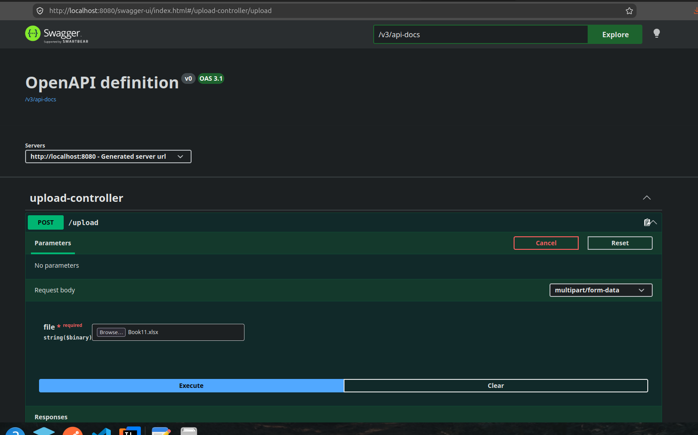

# 📊 Bulk File Upload with Spring Boot & PostgreSQL

A high-performance Spring Boot application designed to parse large Excel files (`.xlsx`) row-by-row and save records to a relational database using optimized batch processing.

---

## 🛠️ Step-by-Step Setup Guide

### 1. Add Project Dependencies
Ensure the following core blocks are present in your `pom.xml` file:

```xml
<!-- Apache POI for Excel Parsing -->
<dependency>
    <groupId>org.apache.poi</groupId>
    <artifactId>poi-ooxml</artifactId>
    <version>5.2.5</version>
</dependency>

<!-- Spring Web Starter -->
<dependency>
    <groupId>org.springframework.boot</groupId>
    <artifactId>spring-boot-starter-web</artifactId>
</dependency>

<!-- Springdoc OpenAPI (Swagger UI - Optional) -->
<dependency>
    <groupId>org.springdoc</groupId>
    <artifactId>springdoc-openapi-starter-webmvc-ui</artifactId>
    <version>2.5.0</version>
</dependency>
```

### 2. Configure Environment Variables
Create a file named `.env` in the absolute root directory of your project (next to your `pom.xml`). Update the properties below to match your local database instance:

```properties
USERNAME=your_database_username
DB_PASSWORD=your_database_password
DB_URL=jdbc:postgresql://localhost:5432/your_database_name
DB_NAME=your_database_name
```

---

## 🧪 Testing the API Endpoint

You can seamlessly test the upload engine without using external tools like Postman by leveraging the built-in **Swagger UI** browser dashboard.

1. Boot up your Spring Boot application locally.
2. Open your preferred web browser and navigate to the endpoint address:
   ```text
   http://localhost:8080/swagger-ui/index.html 
   ```
3. Locate the `POST /upload` multi-part form endpoint, upload your test spreadsheet, and execute the runtime check.

---

### 📷 API Interface Walkthrough

<p align="left">
  
</p>

---
